# Movie Night

**Stop scrolling. Start watching.**

Movie Night is a React Native mobile application for discovering, tracking, and deciding what to watch. Instead of endlessly browsing streaming services, Movie Night helps you find the right film for the right mood — and keeps a personal record of everything you have seen.

---

## What the App Does

Movie Night has two core purposes.

The first is **discovery**. The app pulls live data from The Movie Database (TMDB) and surfaces trending, popular, top-rated, and now-playing movies on the home screen. A full search and filter system lets you narrow results by title, genre, release period, and minimum rating.

The second is **personal tracking**. Every movie you interact with can be saved to a watchlist, marked as a favourite, or logged as watched with a personal 1–5 star rating. All of this data is stored locally on the device and survives app restarts.

The signature feature is the **Movie Picker**. You select a mood (Something Funny, Something Scary, Something Romantic, and so on), how much time you have, and a minimum rating — and the app picks a specific film for you to watch tonight. If you do not like the suggestion, you can pick again without seeing the same movie twice in the same session.

---

## Features

| Feature | Description |
|---|---|
| Trending movies | Weekly trending list pulled from TMDB on the home screen |
| Popular & Top Rated | Separate horizontally scrollable rows for each category |
| Now Playing | Films currently in cinemas |
| Movie search | Real-time debounced search against the TMDB search API |
| Genre filtering | Filter discover results by one or more genres |
| Rating filter | Set a minimum TMDB rating (Any / 6+ / 7+ / 8+) |
| Release period filter | Filter by year or decade |
| Movie details | Full detail screen with backdrop, poster, cast, director, overview, and recommendations |
| Watchlist | Save movies to watch later; persists across restarts |
| Favourites | Mark films you love; persists across restarts |
| Mark as Watched | Log a movie as watched with an optional personal rating |
| Personal ratings | 1–5 star rating stored locally, separate from the TMDB rating |
| Watch history | Full viewing history grouped by month with dates and personal ratings |
| Statistics | Cards showing total movies watched, total watch time, average rating, top genre, and favourite count |
| Movie Picker | Mood + runtime + rating preferences → random film recommendation |
| Pick Again | Re-pick without repeating the same suggestion |
| Let's Watch This | Mark the picked film as watched directly from the result screen |
| Light / Dark / System theme | Three appearance modes, persisted across restarts |
| Favourite genres | Saved genre preferences in Settings |
| Default picker rating | Remembered minimum rating for the Movie Picker |
| Data management | Clear watchlist, favourites, or history individually; full reset with confirmation |
| Loading states | Every async screen shows a spinner while data is fetching |
| Error states | Network failures show a user-friendly message and a working Retry button |
| Empty states | Every empty list has a contextual message and a navigation action |
| Missing data handling | Graceful fallbacks for missing posters, runtimes, overviews, and cast |

---

## Screenshots

### Home Page
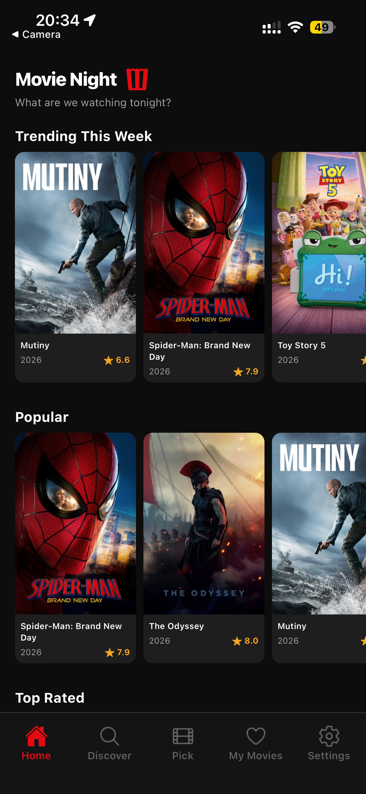

### Search Pages
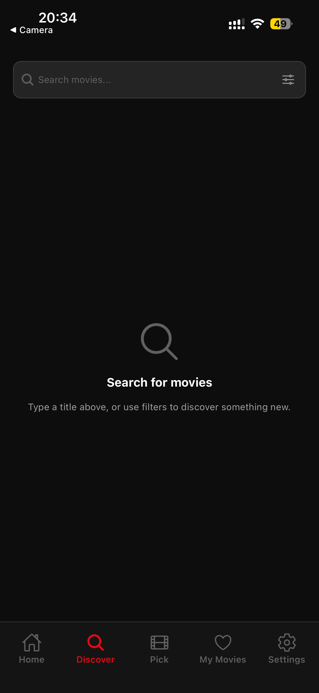
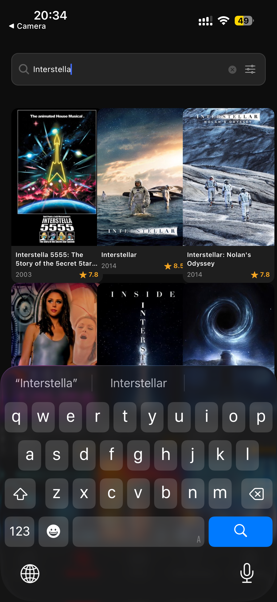
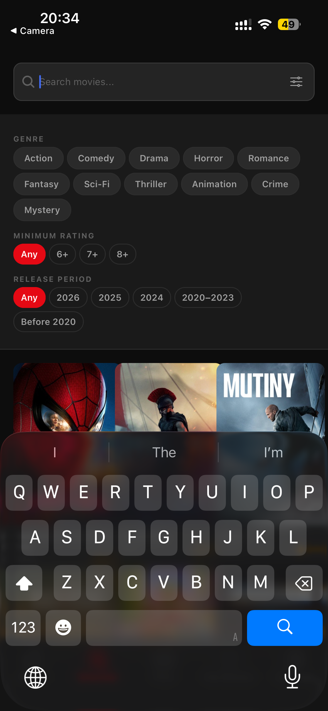

### Movie Picker
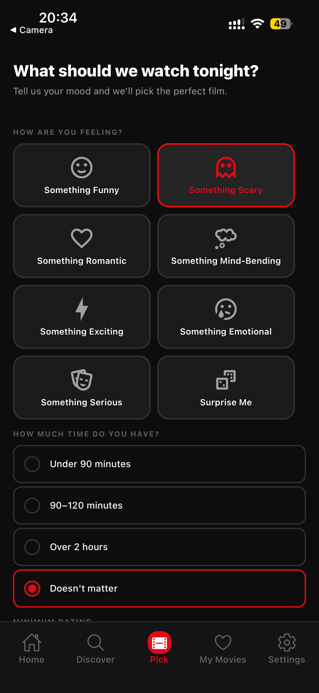
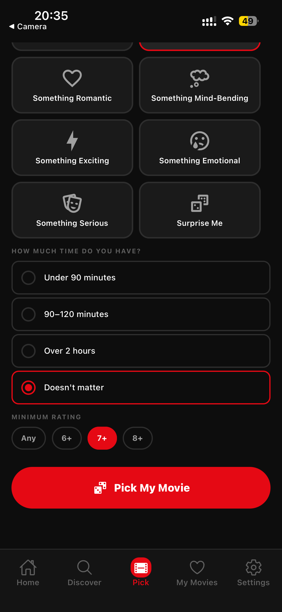
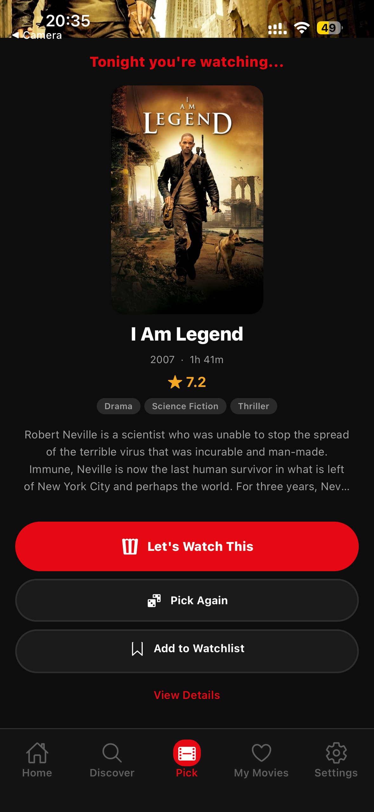
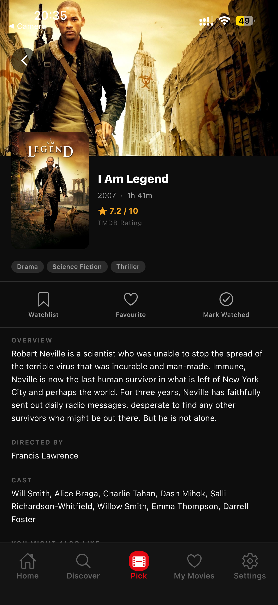

### Rating
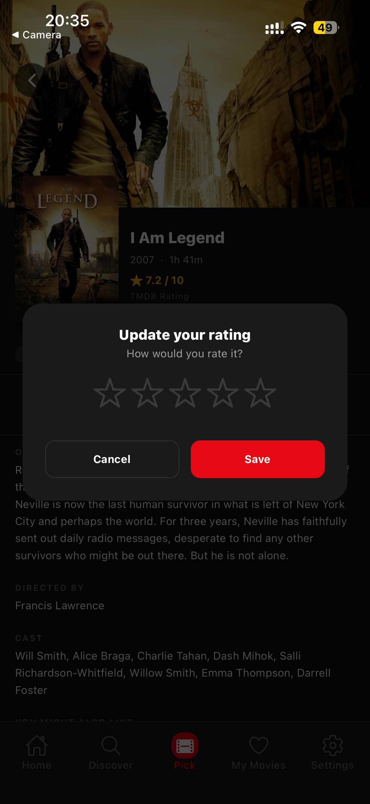

### My Movies Page
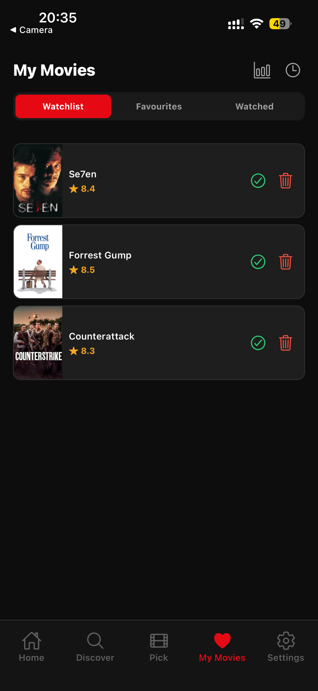
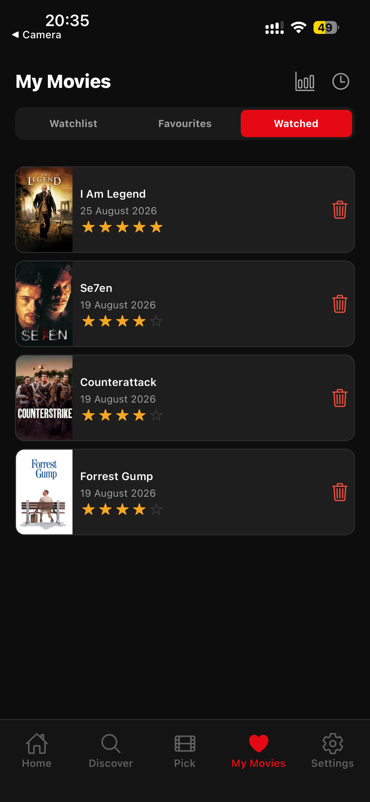

### Settings
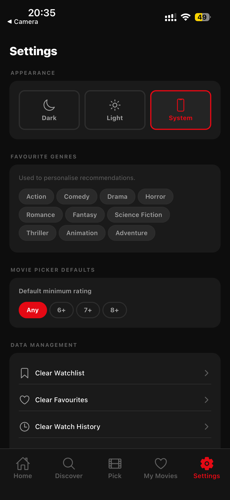

### Statistics
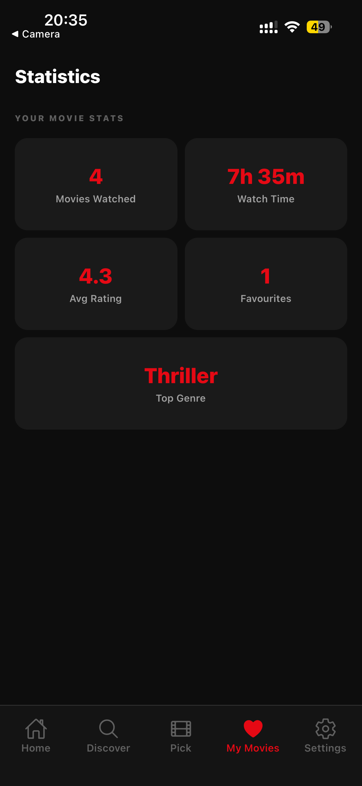

### Watch History
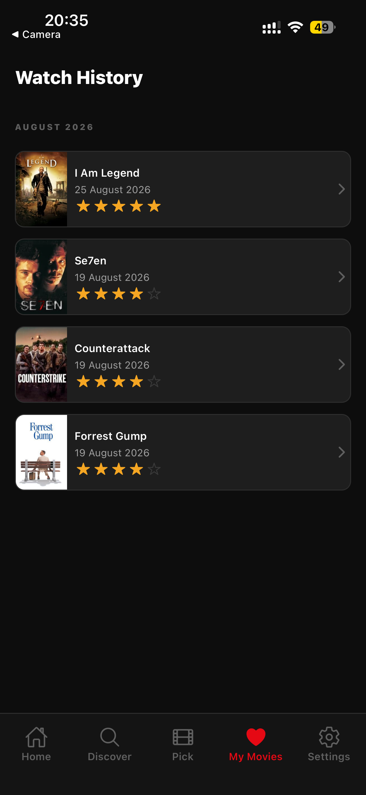

---

## Installation

### Prerequisites

- [Node.js](https://nodejs.org/) (v18 or later)
- [Expo Go](https://expo.dev/client) installed on your phone, **or** an iOS Simulator / Android Emulator

### Steps

**1. Clone or download the project**

```bash
git clone <repository-url>
cd mobileapp
```

**2. Install dependencies**

```bash
npm install
```

**3. Configure the TMDB API token**

Copy the example environment file and add your token:

```bash
cp .env.example .env
```

Open `.env` and replace the placeholder with your real TMDB Read Access Token:

```
EXPO_PUBLIC_TMDB_TOKEN=your_real_token_here
```

See [API Configuration](#api-configuration) below for how to obtain a token.

**4. Start the development server**

```bash
npx expo start
```

**5. Open on your device**

- **Expo Go (physical device):** Scan the QR code shown in the terminal with the Expo Go app.
- **iOS Simulator:** Press `i` in the terminal.
- **Android Emulator:** Press `a` in the terminal.

---

## API Configuration

Movie Night uses the [TMDB API](https://www.themoviedb.org/documentation/api) for all movie data. TMDB is free to use.

**To get your token:**

1. Create a free account at [themoviedb.org](https://www.themoviedb.org/)
2. Go to **Settings → API**
3. Under **API Read Access Token**, copy the long Bearer token (not the short API Key)
4. Paste it into your `.env` file as `EXPO_PUBLIC_TMDB_TOKEN`

The `EXPO_PUBLIC_` prefix is required by Expo. Variables with this prefix are automatically available to your app code at runtime without any build step.

The `.env` file is listed in `.gitignore`. The `.env.example` file shows the required variable name with a placeholder value and is safe to commit.

---

## Project Structure

```
movie-night/
│
├── src/
│   ├── api/
│   │   └── tmdb.js              # All TMDB API functions (single Axios instance)
│   │
│   ├── components/
│   │   ├── MovieCard.jsx         # Reusable poster card with title, year, rating
│   │   ├── MovieRow.jsx          # Horizontal scrollable row of MovieCards
│   │   ├── RatingStars.jsx       # 1–5 star display and interactive rating input
│   │   ├── LoadingState.jsx      # Centred spinner with message
│   │   ├── ErrorState.jsx        # Error message with Retry button
│   │   ├── EmptyState.jsx        # Empty list placeholder with optional action
│   │   ├── SectionHeader.jsx     # Section title with optional action link
│   │   └── GenreChip.jsx         # Selectable genre pill for filters
│   │
│   ├── screens/
│   │   ├── HomeScreen.jsx        # Dashboard with trending / popular / top-rated rows
│   │   ├── DiscoverScreen.jsx    # Search + genre / rating / year filters
│   │   ├── MoviePickerScreen.jsx # Mood, runtime, and rating preference form
│   │   ├── MoviePickerResultScreen.jsx  # Film reveal with actions
│   │   ├── MovieDetailsScreen.jsx       # Full detail view with cast, actions, modal
│   │   ├── MyMoviesScreen.jsx    # Segmented Watchlist / Favourites / Watched
│   │   ├── HistoryScreen.jsx     # Watch history grouped by month
│   │   ├── StatisticsScreen.jsx  # Stat cards calculated from local data
│   │   └── SettingsScreen.jsx    # Theme, genre prefs, picker defaults, data reset
│   │
│   ├── navigation/
│   │   ├── AppNavigator.jsx      # Root NavigationContainer
│   │   ├── TabNavigator.jsx      # Bottom tab bar (5 tabs)
│   │   ├── HomeStack.jsx         # Home → Movie Details
│   │   ├── DiscoverStack.jsx     # Discover → Movie Details
│   │   ├── PickerStack.jsx       # Picker → Result → Movie Details
│   │   └── MyMoviesStack.jsx     # My Movies → Details / History / Statistics
│   │
│   ├── store/
│   │   └── movieStore.js         # Zustand store with AsyncStorage persistence
│   │
│   ├── services/
│   │   └── storage.js            # AsyncStorage utility wrapper
│   │
│   ├── constants/
│   │   ├── colors.js             # Dark/light colour palettes, spacing, font sizes
│   │   ├── genres.js             # TMDB genre IDs, mood map, runtime/rating options
│   │   └── config.js             # TMDB base URLs, image size constants
│   │
│   └── utils/
│       ├── movieHelpers.js       # Poster/backdrop URL builders, formatters, picker helpers
│       └── dateHelpers.js        # Watch date formatting, month grouping
│
├── App.js                        # Entry point — SafeAreaProvider + AppNavigator
├── .env                          # Local environment variables (not committed)
├── .env.example                  # Template showing required variable names
└── package.json
```

---

## Navigation

The app uses a **Bottom Tab Navigator** with five tabs, and **Native Stack Navigators** nested inside each tab so that Movie Details is accessible from every section.

```
Bottom Tabs
├── Home
│   └── Movie Details
│
├── Discover
│   └── Movie Details
│
├── Pick
│   ├── Movie Picker Result
│   │   └── Movie Details
│
├── My Movies
│   ├── Movie Details
│   ├── Watch History
│   └── Statistics
│
└── Settings
```

Each tab has its own independent navigation stack. This means navigating to Movie Details from the Home tab does not interfere with the navigation state of the Discover tab. The Android back button is handled correctly by React Navigation's native stack.

The Pick tab icon is highlighted with a primary-colour pill when active to draw attention to it as the app's main feature.

---

## State Management

**Zustand** is used for all global application state.

Zustand was chosen over React Context for three reasons:

1. No provider wrapping — any component can read or write state with a single hook call.
2. Selectors prevent unnecessary re-renders — a component only re-renders when the specific slice of state it subscribes to changes.
3. The `persist` middleware integrates with AsyncStorage in a single line, handling serialisation automatically.

### What is stored globally

| State slice | Contents |
|---|---|
| `watchlist` | Array of movie objects the user wants to watch |
| `favourites` | Array of movie objects the user has marked as favourite |
| `watchedMovies` | Array of `{ movie, watchedAt, personalRating }` entries |
| `theme` | `'dark'` / `'light'` / `'system'` |
| `preferences` | `{ defaultMinRating, favouriteGenreIds }` |

### Actions

The store exposes named action functions (`addToWatchlist`, `toggleFavourite`, `markAsWatched`, `rateMovie`, `setTheme`, and so on). Components call these directly rather than dispatching generic actions, which keeps the intent of each interaction clear.

Fetched API data (trending movies, search results) is kept in local component state using `useState`. There is no reason to share a screen's temporary data globally, and doing so would waste memory and complicate the store.

---

## Persistence

**AsyncStorage** stores all user-owned data so that it survives app restarts and device reboots.

Persistence is handled by Zustand's `persist` middleware with `createJSONStorage(() => AsyncStorage)`. The entire store is serialised to a single AsyncStorage key (`movie-night-store`) every time state changes. On app launch, Zustand rehydrates the store before the first render, so there is no flash of empty data.

### What persists

- Watchlist
- Favourites
- Watched movies, watch dates, and personal ratings
- Theme preference
- Favourite genre selections
- Movie Picker default minimum rating

### What does not persist

- Trending, popular, top-rated, and search results — these are always fetched fresh from TMDB.

---

## API Integration

All TMDB communication goes through `src/api/tmdb.js`. This file creates a single Axios instance with the Bearer token in the Authorization header and a 10-second timeout. Every screen imports named functions from this module (`getTrendingMovies`, `searchMovies`, `getMovieDetails`, etc.) rather than constructing raw requests inline.

### Endpoints used

| Function | TMDB Endpoint |
|---|---|
| `getTrendingMovies` | `/trending/movie/week` |
| `getPopularMovies` | `/movie/popular` |
| `getTopRatedMovies` | `/movie/top_rated` |
| `getNowPlayingMovies` | `/movie/now_playing` |
| `searchMovies` | `/search/movie` |
| `discoverMovies` | `/discover/movie` |
| `getMovieDetails` | `/movie/{id}` |
| `getMovieCredits` | `/movie/{id}/credits` |
| `getMovieRecommendations` | `/movie/{id}/recommendations` |
| `getSimilarMovies` | `/movie/{id}/similar` |

Poster and backdrop image URLs are constructed using the helpers in `movieHelpers.js`, which prepend the TMDB image CDN base URL and the appropriate size string.

---

## Error Handling

Every screen that makes a network request handles three states: loading, success, and error.

| State | What the user sees |
|---|---|
| Loading | Spinner with "Loading movies…" (or context-specific message) |
| Success | The requested content |
| Network error | Error message with a **Retry** button that re-executes the request |
| Empty results | Empty state with an icon, description, and a navigation shortcut |
| Missing TMDB data | Graceful fallback text (e.g. "Runtime unavailable", "No overview available") |
| Missing poster | A placeholder icon instead of a broken image |

Raw Axios error objects are never shown to the user. Errors are caught in `catch` blocks, logged to the console for debugging, and replaced with a friendly string before being passed to the `ErrorState` component.

---

## Testing

The following tests were carried out manually on a physical iPhone running Expo Go.

| Test | Expected Result | Actual Result | Status |
|---|---|---|---|
| App launches | Home screen loads with no errors | Loaded correctly | PASS |
| Home screen fetches data | Trending, Popular, Top Rated, Now Playing rows appear | All four rows displayed | PASS |
| Pull to refresh | Home screen refetches all rows | Data refreshed | PASS |
| Movie card tap | Navigates to Movie Details | Navigated correctly | PASS |
| Movie Details loads | Backdrop, poster, title, rating, genres, overview displayed | All elements present | PASS |
| Cast and director shown | Credits appear below overview | Displayed correctly | PASS |
| Recommendations shown | Horizontally scrollable row of recommended films | Displayed correctly | PASS |
| Add to Watchlist | Button label changes to "In Watchlist" immediately | Updated instantly | PASS |
| Remove from Watchlist | Button reverts to "Watchlist" | Reverted correctly | PASS |
| Favourite toggle | Icon fills / unfills immediately | Toggled correctly | PASS |
| Mark as Watched | Modal appears with star rating input | Modal displayed | PASS |
| Save rating | Rating stored, star display updates | Stored and displayed | PASS |
| Edit rating | Re-opening modal shows existing rating, allows change | Updated correctly | PASS |
| TMDB and personal rating are separate | TMDB shows "8.4 / 10", personal shows stars | Displayed separately | PASS |
| Movie search | Typing returns relevant results with 500ms debounce | Results appeared | PASS |
| Empty search | No results message shown | Empty state displayed | PASS |
| Genre filter | Results update to match selected genre | Filter applied | PASS |
| Rating filter | Results have minimum vote average applied | Filter applied | PASS |
| Year filter | Results restricted to selected period | Filter applied | PASS |
| Reset Filters | All filters cleared, results reset | Cleared correctly | PASS |
| My Movies – Watchlist tab | Saved movies listed | Displayed correctly | PASS |
| My Movies – Favourites tab | Favourite movies listed | Displayed correctly | PASS |
| My Movies – Watched tab | Watched movies with date and stars listed | Displayed correctly | PASS |
| Remove from Watchlist (My Movies) | Confirmation alert shown; item removed | Removed after confirm | PASS |
| Mark as Watched from Watchlist | Movie appears in Watched tab | Moved correctly | PASS |
| Empty Watchlist state | "Your watchlist is empty" with Discover button | Displayed correctly | PASS |
| Movie Picker – mood selection | Cards highlight on tap | Selection works | PASS |
| Movie Picker – Pick My Movie | Navigates to result screen with a film | Result displayed | PASS |
| Movie Picker – no mood selected | Button disabled / greyed out | Button inactive | PASS |
| Pick Again | Different film shown; original not repeated immediately | New film selected | PASS |
| Let's Watch This | Film marked as watched; navigates to details | Marked and navigated | PASS |
| Add to Watchlist (result screen) | Button label changes to "In Watchlist" | Updated instantly | PASS |
| Watch History | Movies grouped by month in chronological order | Grouped correctly | PASS |
| Statistics | Cards show correct counts and labels | Calculated correctly | PASS |
| Theme – Dark | Dark backgrounds applied across all screens | Applied correctly | PASS |
| Theme – Light | Light backgrounds applied across all screens | Applied correctly | PASS |
| Theme – System | Follows device appearance setting | Followed correctly | PASS |
| Favourite genres saved | Selected genres retained after leaving Settings | Persisted | PASS |
| Default picker rating saved | Picker opens with saved default | Applied correctly | PASS |
| Clear Watchlist | Confirmation shown; watchlist emptied | Cleared after confirm | PASS |
| Clear Favourites | Confirmation shown; favourites emptied | Cleared after confirm | PASS |
| Clear History | Confirmation shown; watch history emptied | Cleared after confirm | PASS |
| Reset All App Data | Confirmation shown; all data cleared | Reset after confirm | PASS |
| Persistence after restart | Watchlist, favourites, and watched movies still present | Data survived | PASS |
| Missing poster | Placeholder icon shown instead of broken image | Placeholder displayed | PASS |
| Network error on Home | Error message and Retry button shown | Error state displayed | PASS |
| Retry button | Re-fetches data successfully | Data loaded on retry | PASS |
| Bottom tab navigation | All five tabs navigable | Navigation works | PASS |
| Back navigation | Back button returns to previous screen | Navigation correct | PASS |
| Safe area (iPhone notch) | Tab bar labels visible above home indicator | Displayed correctly | PASS |

---

## Technologies Used

| Technology | Version | Purpose |
|---|---|---|
| React Native | 0.86.2 | Core mobile framework |
| Expo | ~57.0.14 | Development toolchain and Expo Go compatibility |
| React | 19.2.3 | UI rendering |
| React Navigation | 7.x | Screen navigation (bottom tabs + native stacks) |
| Zustand | 5.x | Global state management |
| AsyncStorage | 2.2.0 | Local data persistence |
| Axios | 1.x | HTTP requests to TMDB API |
| Expo Vector Icons | 15.x | Ionicons and MaterialCommunityIcons |
| React Native Safe Area Context | 5.x | Safe area inset handling |
| React Native Screens | 4.x | Native screen optimisation for navigation |
| TMDB API | v3 | Movie data, images, search, and discovery |

---

## Known Issues

- **Runtime filtering in the Movie Picker is approximate.** TMDB's discover endpoint does not return runtime in list results. The app fetches full details for up to 12 candidate films to check their runtime. If all 12 fall outside the preferred range, the picker may return no results even though eligible films exist further in the results.

- **Search does not paginate.** The Discover and Search screens return the first page of results only (up to 20 items). Infinite scroll or a "Load More" button has not been implemented.

- **Statistics genre detection is best-effort.** Movies stored from list endpoints include `genre_ids` (numeric IDs). Movies stored from detail endpoints include `genres` (objects). The statistics screen handles both formats, but genre data may be missing for some older saved entries if the movie object was stored without genre information.

- **No offline mode.** The app requires an internet connection to load movie data. Previously saved watchlist, favourites, and watch history are available offline, but no new content can be fetched.

---

## Future Improvements

- **Infinite scroll / pagination** on the Discover and Search screens
- **Streaming provider availability** — TMDB's watch providers endpoint could show which services have each film
- **Push notifications** — remind users to watch something from their watchlist
- **Sharing** — share a movie pick or watchlist with a friend
- **Cloud sync** — back up user data to a cloud service so it is not lost if the device is replaced
- **Improved recommendations** — use the user's favourite genres and watch history to weight the Movie Picker towards films they are more likely to enjoy
- **Advanced statistics** — charts showing watching trends over time, genres watched by month, and rating distributions

---

## Reflection

### What was learned

Building Movie Night was a comprehensive introduction to production-style React Native development. Every major area of mobile app development was touched: navigation architecture, external API integration, global state management, local persistence, and platform-specific concerns like safe area insets.

### Challenges

The most significant challenge was understanding the relationship between Zustand's `persist` middleware and AsyncStorage hydration. On first launch the store is empty; on subsequent launches it needs to be rehydrated from storage before the UI renders. Getting this right — so that saved data appears immediately without a visible flash — required understanding the asynchronous nature of storage reads and how Zustand handles them internally.

The Movie Picker's runtime filtering was a second challenge. TMDB's discover endpoint returns list-level data that does not include runtime, which means an additional detail request is required for each candidate film before a final selection can be made. Balancing the quality of the filter against the number of extra API calls required a deliberate trade-off.

### React Native development

React Native's approach of mapping JavaScript components to native views is powerful but has a learning curve. Understanding which layout properties apply at which level, how `flexbox` behaves differently from web CSS in certain edge cases (particularly with `flexWrap` and percentage widths), and how to handle platform differences between iOS and Android all required careful reading of documentation and testing on real devices.

### State management

Zustand proved to be a good choice for this project. Its minimal API meant state logic could be expressed clearly without the boilerplate associated with more complex solutions. Keeping API-fetched data in local component state and only using the global store for user-owned data kept the architecture clean and easy to reason about.

### Persistence

AsyncStorage is straightforward to use but requires careful thought about what to store. Storing entire movie objects (rather than just IDs) means that watchlist and history entries remain readable even when offline, but it also means the stored data can become stale if a movie's TMDB information changes. For the scope of this application this is an acceptable trade-off.

### UI and UX

The cinema-inspired dark theme was a deliberate design decision. Movie poster artwork provides most of the visual interest, so the UI is intentionally restrained — dark backgrounds, minimal chrome, and consistent spacing let the posters carry the visual weight. The light theme maintains the same structure with higher contrast for users who prefer it.

### Testing

Manual testing on a physical device revealed several issues that would not have been caught by looking at the code alone — particularly around safe area handling on the iPhone notch and the behaviour of the tab bar at different screen sizes. Maintaining a comprehensive test checklist and ticking items off systematically made it straightforward to confirm that every feature worked end to end.

### What could be improved

With more time, automated component tests using a library like React Native Testing Library would complement the manual testing and catch regressions earlier. The Movie Picker's runtime filter could be made more robust by fetching a larger candidate pool. Pagination would make the Discover screen significantly more useful for users who want to browse beyond the first twenty results.
